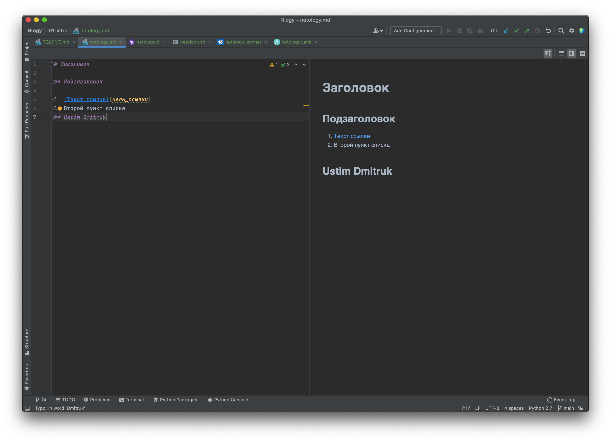

---

# Домашнее задание к занятию «1.1. Введение в DevOps»

## Задание №1 - Подготовка рабочей среды

1. Screens:
    - Terraform: 
    - Bash: 
    - Markdown: 
    - Yaml: 
    - Jsonnet: 
 

## Задание №2 - Описание жизненного цикла задачи (разработки нового функционала)

1. Постановка задачи Заказчиком.
2. Менеджер/Тимлид - Приблизительная оценка объёма затрат в человеко-часах и принятие решения о необходимости разбиения задачи на мелкие с определением их приоритета.
3. DevOps - организует возможность автоматической подготовки окружения к различным типам проводимого тестирования. 
4. Реализация разработчиками задачи в целом или ее отдельных подзадач + покрытие нового кода тестами. Передача релиза для загрузки в тестовое окружение и последующей работы QA.
5. Тестировщики - проводят тестирование нового функционала.
   - В случае неудачного проведения тестирования DevOps предоставляет доступ разработчикам к логам для формирования понимания проблемы и ее устранения. После, DevOps приводит окружение к первоначальному состоянию для проведения повторного тестирования.
6. В случае успешного проведения тестирования DevOps сообщает информацию Менеджеру для приемки работ заказчиком.
7. Если заказчик обосновано не принимает работы, то мы переходим к п.4. В ином случае DevOps готовит релиз для публикации в продуктивной среде. В этом случае DevOps отслеживает состояние системы для ее оперативного отката.
8. Дальнейшая работа DevOps связана с мониторингом состояния системы по заданным атрибутам, в случае появления проблемы создается инцидент для доработки системы.

Таким образом DevOps является связующим звеном между участниками команды (разработчики, тестировщики, менеджеры) дабы создать унифицированную среду/окружение разработки и тестирования, позволяя другим участникам команды сосредоточится только на их узких обязанностях.
Поскольку DevOps является связующим звеном, то он должен обладать знаниями тех участников с которыми тесно контактирует.

